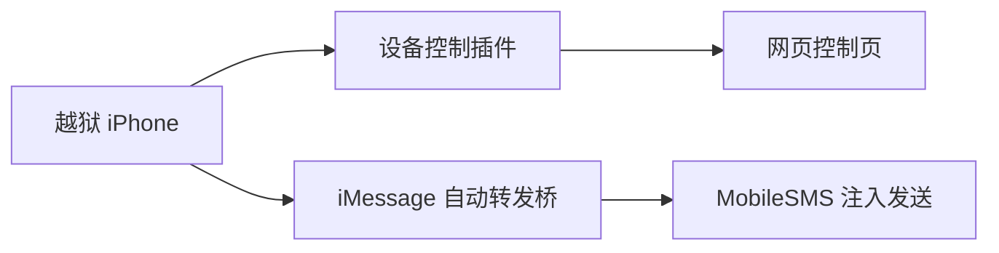

# iPhone 设备控制与 iMessage 自动转发

这是一个精简的软件源仓库，只保留两个仍在维护的插件：

- `com.devicecontrol.remote`
- `com.ctf.immsgbridge`

这个仓库的目标不是收集所有历史试验包，而是只发布当前仍在使用、仍在维护的稳定版本。

---

## 这个仓库提供什么

### 1）设备控制插件

`com.devicecontrol.remote` 用于在越狱 iPhone 上提供一个网页控制入口。  
它适合作为设备控制能力的稳定基线版本使用。

### 2）iMessage 自动转发桥

`com.ctf.immsgbridge` 用于监听消息数据库中的新入站消息，并仅通过 iMessage 路径执行自动转发。  
它的设计原则是：

- 只允许 iMessage
- 不允许 SMS fallback
- 不能确认 iMessage 可用时直接失败

---

## 当前包

| 包名 | 版本 | 作用 |
|---|---:|---|
| `com.devicecontrol.remote` | `1.0.1` | 设备控制插件稳定版 |
| `com.ctf.immsgbridge` | `0.2.4` | iMessage-only 自动转发桥 |

---

## 仓库结构

```text
.
├─debs/
├─Packages
├─Packages.gz
├─Packages.bz2
├─Packages.xz
├─Packages.lzma
├─Release
├─index.html
└─README.md
```

---

## 工作关系



---

## 如何使用

1. 在包管理器中添加本软件源
2. 刷新软件源
3. 安装需要的插件：
   - `com.devicecontrol.remote`
   - `com.ctf.immsgbridge`

当前源中只保留这两个插件，不再包含旧实验版和其他远控方案。

---

## 注意事项

### 1）仅适用于越狱环境

这两个插件默认运行在越狱 iPhone 环境中，需要具备注入能力和相应路径权限。

### 2）自动转发只允许 iMessage

`com.ctf.immsgbridge` 不允许：

- SMS fallback
- CoreTelephony 短信发送路径

如果 iMessage 不可用，则应直接失败。

### 3）当前只保留稳定发布集

仓库中历史试验包、探针包、重复版本、其他远控实现都已清理，只保留当前发布版本。

---

## 维护说明

- 历史实验包已清理
- 其他远控方案已清理
- 仓库只保留当前稳定发布集
- 发布索引只对应当前两个插件
