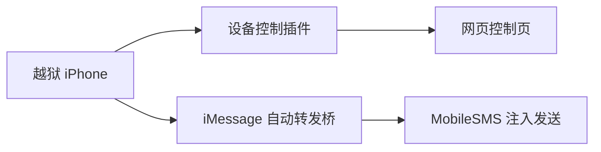

# iPhone 设备控制与 iMessage 自动转发

这是一个精简的软件源仓库，只保留两个仍在维护的包：

- `com.devicecontrol.remote`
- `com.ctf.immsgbridge`

仓库内容已清理为最小发布集，只包含当前版本 deb 和软件源索引文件。

---

## 当前包

| 包名 | 版本 | 作用 |
|---|---:|---|
| `com.devicecontrol.remote` | `1.0.1` | 设备控制插件 |
| `com.ctf.immsgbridge` | `0.2.4` | iMessage-only 自动转发桥 |

---

## 仓库结构

```text
.
├─debs/
├─Packages
├─Packages.gz
├─Packages.bz2
├─Packages.xz
├─Packages.lzma
├─Release
├─index.html
└─README.md
```

---

## 组件关系



---

## 自动转发约束

- 仅允许 iMessage
- 不允许 SMS fallback
- 不使用 CoreTelephony 短信发送路径

---

## 维护说明

- 历史实验包已清理
- 其他远控方案已清理
- 仓库只保留当前稳定发布集
