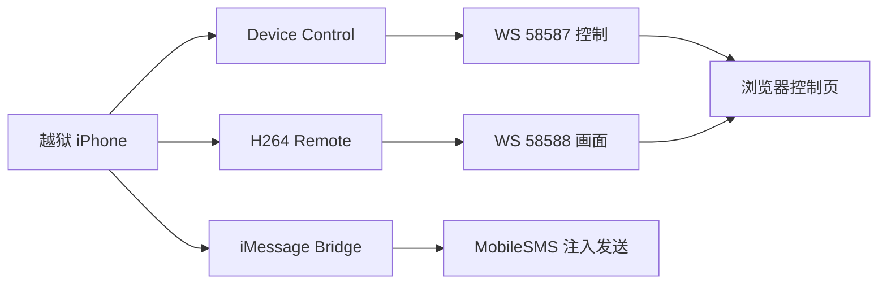

# iPhone 远控与信息自动转发

这个仓库现在只保留两个方向：

1. **远控**：设备控制插件、H.264 快速画面页、Windows 侧网关脚本。
2. **信息自动转发**：仅通过 iMessage 转发，不走 SMS fallback。

---

## 当前保留的包

| 包名 | 版本 | 作用 |
|---|---:|---|
| `com.devicecontrol.remote` | `1.0.1` | 设备控制插件稳定基线 |
| `com.ctf.immsgbridge` | `0.2.4` | iMessage-only 自动转发桥 |
| `com.ctf.h264remote` | `0.1.6` | H.264 快速画面通道 |

---

## 仓库结构

```text
.
├─debs/
├─Packages
├─Packages.gz
├─Packages.bz2
├─Packages.xz
├─Packages.lzma
├─Release
├─iphone-h264-control.html
├─iphone-h264-device.html
├─webrtc-server.js
└─index.html
```

---

## 组件关系



---

## 自动转发约束

- 仅允许 **iMessage**
- 不允许 **SMS/CoreTelephony fallback**
- 失败只返回结果，不转短信

---

## 说明

- 仓库中的历史试验包、探针包、重复版本已经清理。
- 若要查看本地源码工作区结构，请看本地工作区根目录的 `README.md`。
