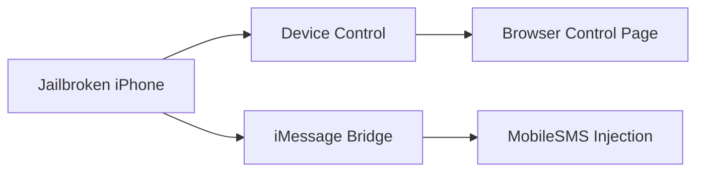

# iPhone Remote Control & iMessage Forwarding

Minimal release repository for two maintained jailbreak packages:

- `com.devicecontrol.remote`
- `com.ctf.immsgbridge`

This repo is kept intentionally small and only contains the currently shipped packages plus the package index files required by Sileo/Zebra/Cydia-style clients.

---

## Packages

| Package | Version | Purpose |
|---|---:|---|
| `com.devicecontrol.remote` | `1.0.1` | Web-based device control plugin |
| `com.ctf.immsgbridge` | `0.2.4` | iMessage-only forwarding bridge |

---

## Repository Structure

```text
.
├─debs/
├─Packages
├─Packages.gz
├─Packages.bz2
├─Packages.xz
├─Packages.lzma
├─Release
├─index.html
└─README.md
```

---

## Component Overview



---

## Forwarding Constraints

- iMessage only
- No SMS fallback
- No CoreTelephony send path

---

## Maintenance Notes

- Historical test packages have been removed
- Unused remote-control variants have been removed
- The source is intentionally trimmed to the current stable release set
